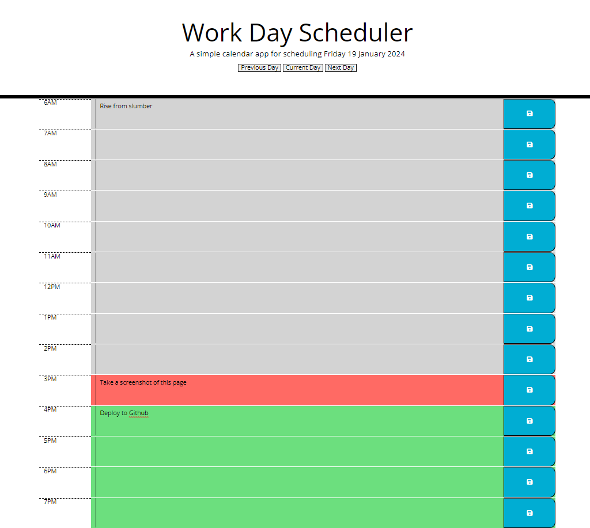
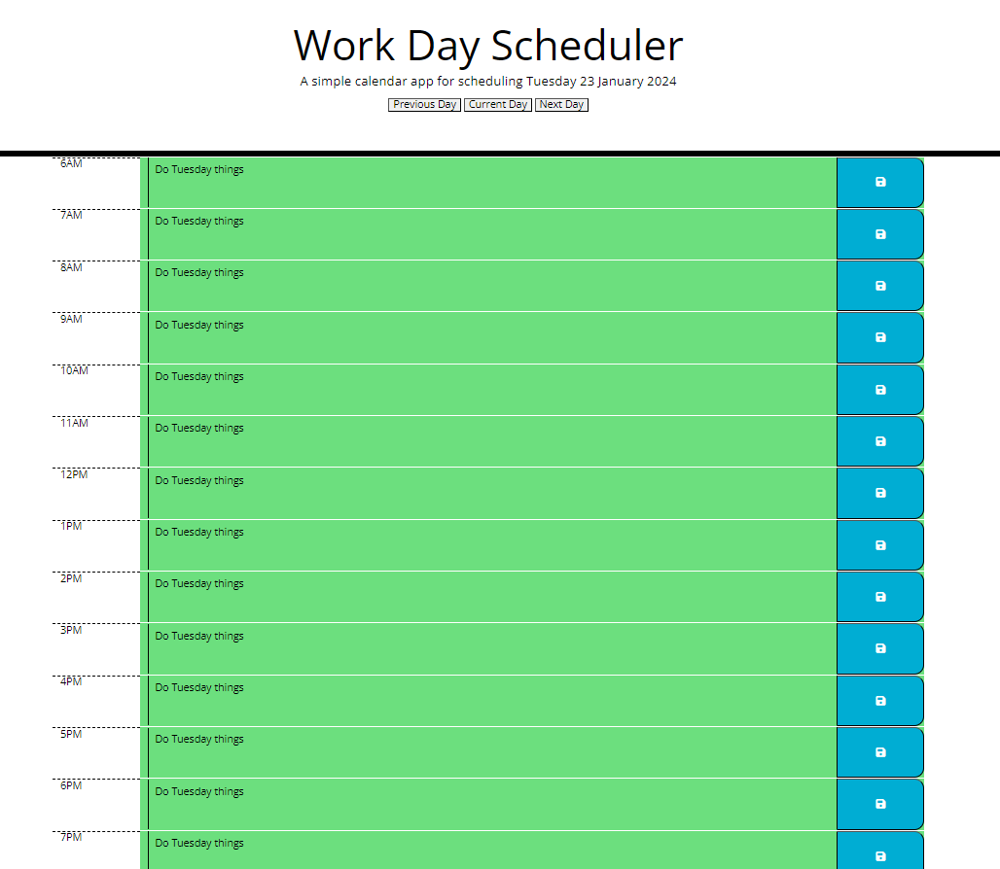
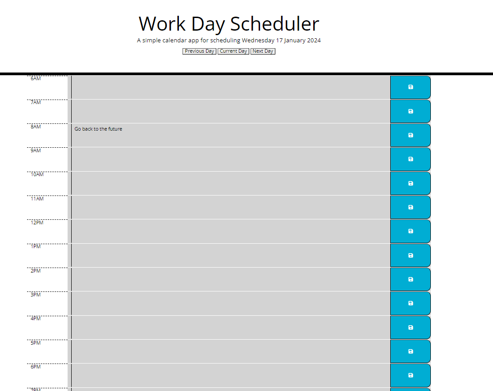

# work-day-planner

Author: Maksim Aliochin

# 

## Table of Contents

- [Description](#description)
- [How To Use](#how-to-use)
- [Screenshots Of Use](#screenshots-of-use)
- [Goals For Development](#goals-for-development)
- [Elements that could be improved](#elements-that-could-be-improved)

## Description

A planner that uses local storage to store plans for specified hours for any day. The planner in current form is only meant to plan a few days in advance as there is no calendar selctor only a previous, next and current day buttons. All data is saved in the user's cache therefore if ever cleared all plans are lost.

## How To Use

Go to [the site linked in the repo] and begin using. If you wish to contribute please fork the project and suumbit a pull request.

## Screenshots Of Use





## Goals for development

### User Story

```md
AS AN employee with a busy schedule
I WANT to add important events to a daily planner
SO THAT I can manage my time effectively
```

### Acceptance Criteria

The app should:

- Display the current day at the top of the calender when a user opens the planner.

- Present timeblocks for standard business hours when the user scrolls down.

- Color-code each timeblock based on past, present, and future when the timeblock is viewed.

- Allow a user to enter an event when they click a timeblock

- Save the event in local storage when the save button is clicked in that timeblock.

- Persist events between refreshes of a page

The following animation demonstrates the application functionality:


## Elements that could be improved

As previously mentioned the buttons can be replaced for a calendar, this would be better for the user experience and would allow for planning much further in advance, without the user having to click next day button 73 times.
Fix the styling error for the hour cells, colour underneath extends to far and is visible under the save button.
